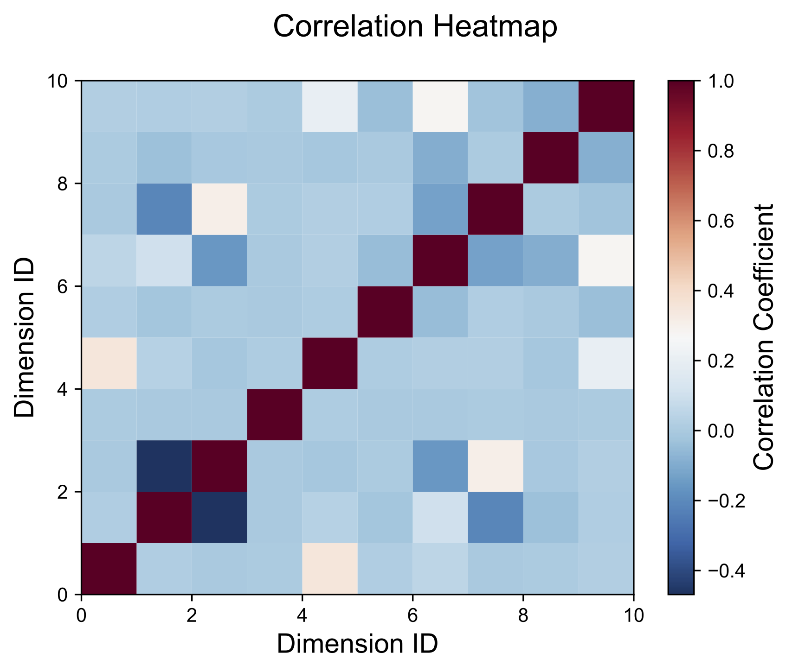

# corr-heatmap

A hacked-together correlation heatmap generator. Dependencies:

* numpy
* matplotlib

Usage: `python plot.py <correlation-matrix>`

Where correlation-matrix is a whitespace-separated text file containing the correlation matrix. See `test.features.txt` for an example.

This will produce an output something like the following:

